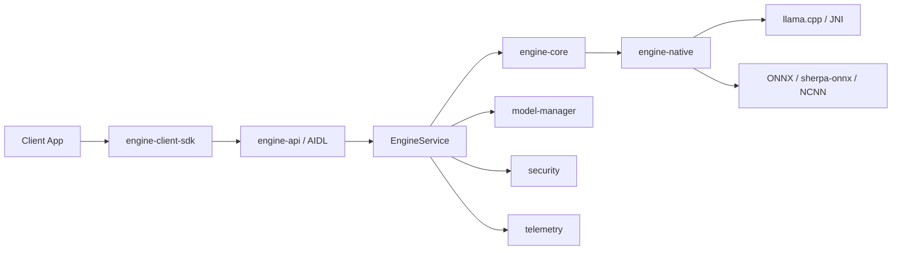

# R2H AI Engine

Local-first Android AI runtime and IPC service for R2H applications.

R2H AI Engine is a modular Android engine that hosts on-device inference in a dedicated process and exposes a controlled client interface through AIDL. The project separates public IPC contracts, client integration, inference orchestration, native runtimes, model lifecycle management, security enforcement, and local telemetry into independent Gradle modules.

## Highlights

- **Local-first inference** with no `INTERNET` permission in the engine application.
- **Dedicated engine process** (`:engine`) for runtime isolation.
- **Signature-protected IPC** through `r2h.permission.BIND_ENGINE`.
- **AIDL-based API contract** for client applications.
- **Native inference bridge** built around `llama.cpp` and JNI/CMake.
- **ONNX / sherpa-onnx / NCNN runtime integration** for non-LLM capabilities.
- **Model lifecycle management** with download, local storage, SHA-256 validation, and model hot-swap responsibilities isolated in `model-manager`.
- **Local-only telemetry** designed as a passive sink with no outbound traffic and no prompt/response-content logging.
- **ARM64 production target** with explicit native packaging checks.
- **Release signing guardrails** that prevent release packaging when signing configuration is missing.

## Architecture



### Module responsibilities

| Module | Responsibility |
| --- | --- |
| `app` | Android host application, foreground engine service, runtime status UI, model-management UI, security-management UI, and local-device capability services. |
| `engine-api` | Standalone public AIDL interfaces, Parcelable DTOs, and engine error contracts. |
| `engine-client-sdk` | Client-side Android bridge for consuming the engine API. |
| `engine-core` | Inference orchestration, request queueing, session management, and service-side execution flow. |
| `engine-native` | JNI/C++ bridge and native runtime integration. |
| `model-manager` | Model discovery/download, storage, SHA-256 validation, and lifecycle operations. |
| `security` | IPC caller validation, signature verification, allowlist enforcement, and rate-limiting responsibilities. |
| `telemetry` | Local structured event logging with no outbound transport. |

## Platform and toolchain

- **Android Gradle project**
- **Java:** 17
- **App / engine compile SDK:** 37
- **Public API / client SDK compile SDK:** 36
- **App / engine minimum SDK:** 28
- **Public API / client SDK minimum SDK:** 26
- **Native ABI:** `arm64-v8a`
- **Android NDK:** `27.2.12479018`
- **CMake:** `3.22.1`

The native module pins its NDK version to keep native builds reproducible.

## Repository setup

Clone the repository and initialize the `llama.cpp` submodule:

```powershell
git clone https://github.com/ramyelattar/r2h-ai-engine.git
cd r2h-ai-engine
git submodule update --init --recursive
```

> **Important:** `third_party/` is intentionally not tracked in this repository. Some native packaging and smoke-test tasks reference runtime artifacts under `third_party/runtimes/`. Provision the required local runtime dependencies before building targets that consume them.

Large production model artifacts are also intentionally kept outside normal Git tracking. The application build is configured so heavy model files are not packaged into normal APK assets.

## Build

### Debug APK

```powershell
.\gradlew.bat assembleDebug
```

### Unit tests

```powershell
.\gradlew.bat test
```

### Build individual SDK modules

```powershell
.\gradlew.bat :engine-api:assembleRelease
.\gradlew.bat :engine-client-sdk:assembleRelease
```

### Release build

Release builds require signing configuration. Supply the following Gradle properties through the developer Gradle home or command-line `-P` properties:

```text
R2H_RELEASE_STORE_FILE
R2H_RELEASE_STORE_PASSWORD
R2H_RELEASE_KEY_ALIAS
R2H_RELEASE_KEY_PASSWORD
```

Then run:

```powershell
.\gradlew.bat assembleRelease
```

The build fails intentionally if release signing is required but not configured, or if the configured keystore does not exist.

## Native runtime policy

`engine-native` is the only native bridge consumed by `engine-core`. Production native packaging targets `arm64-v8a` and includes checks intended to prevent unsupported ABIs and duplicate ONNX Runtime payloads from entering the release APK.

The current native stack includes:

- `llama.cpp` for local LLM inference through JNI/CMake.
- Microsoft ONNX Runtime for Android.
- `sherpa-onnx` native libraries.
- NCNN runtime support.

The project uses a single canonical ONNX Runtime provider for the packaged native stack to avoid shipping duplicate runtime implementations.

## Model handling

`model-manager` owns model-file resolution and lifecycle concerns. Its responsibilities include:

- model download/import flows;
- application-local model storage;
- SHA-256 validation;
- model metadata exposure through shared API types;
- runtime model replacement / hot-swap coordination.

Production models should be treated as external runtime assets rather than source-controlled application resources.

## IPC and security model

The engine service is exported for trusted R2H clients but protected with a signature-level permission:

```text
r2h.permission.BIND_ENGINE
```

The service runs in a dedicated `:engine` process. The security module is intentionally separated from inference and model-management code so caller validation and policy enforcement remain isolated from runtime business logic.

Additional application hardening includes:

- `android:allowBackup="false"`;
- `android:usesCleartextTraffic="false"`;
- signature-protected engine binding;
- no `INTERNET` permission in the application manifest.

## Local device capabilities

The host application declares optional/local permissions for capabilities such as camera, microphone, contacts, calendar, location, Bluetooth, notification access, accessibility integration, and usage access. These permissions do not imply network processing; the engine application intentionally omits internet access.

## Telemetry

Telemetry is designed to remain local to the device. The telemetry module is a passive structured-event sink and must not log prompt or response content.

## Client integration

Client applications should integrate through `engine-client-sdk`, which exposes the public `engine-api` contract and hides binder/service plumbing from application code.

Published module coordinates are currently versioned at `0.1.0`:

```text
io.r2h:engine-api:0.1.0
io.r2h.engine:engine-client-sdk:0.1.0
```

## Project status

This repository represents the active R2H AI Engine codebase. Native runtime inputs and large production models are intentionally managed outside the tracked source tree, so a fresh checkout may require local runtime provisioning before all native and release build targets can succeed.
